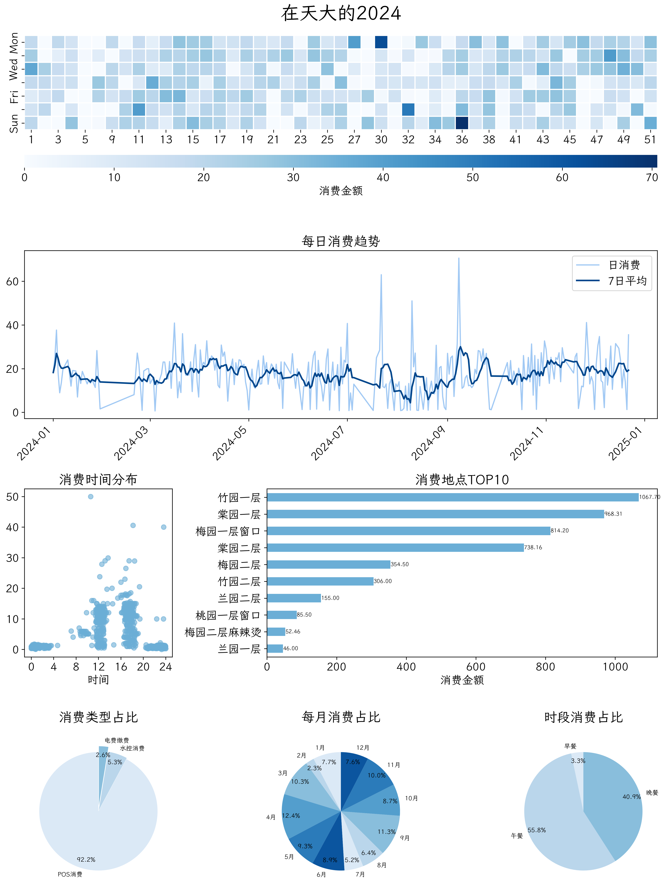

# TJU-Expense

[](https://github.com/superpung/tju-expense/releases/latest)
[](https://github.com/superpung/tju-expense/releases/latest)
[](https://github.com/superpung/tju-expense/releases/latest)
[](https://github.com/superpung/tju-expense/releases/latest/download/tju-expense-windows.exe)
[](https://github.com/superpung/tju-expense/releases/latest/download/tju-expense-macos)
[](https://github.com/superpung/tju-expense/releases/latest/download/tju-expense-linux)

一年过去了，你在天大食堂里花的钱都花在哪儿了？

## 简介

> 本项目参考自 [leverimmy/THU-Annual-Eat](https://github.com/leverimmy/THU-Annual-Eat)。

本项目是一个用于统计 TJU 学生在食堂（和宿舍）的消费情况的脚本。通过模拟登录 TJU 校园卡网站，获取学生在 TJU 食堂的消费记录，并通过数据可视化的方式展示。



🎉 本项目已适配 Windows，无需配置环境即可使用！


## 使用方法

> [!NOTE]
> 此方法无需 Python 环境。

### 0. 获取 Cookie

1. 使用浏览器访问 [天津大学财务处](https://finance.tju.edu.cn/)，点击“一卡通服务平台”（或直接访问 [校园卡网站](http://59.67.37.10:8180/epay/person/index)）并登录

2. `F12` 打开 开发者工具 - Application - Storage - Cookies，拷贝其中 `JSESSIONID` 的 `Value`


3. （可选）在执行目录下新建 `.env` 文件，写入以下内容：

```
COOKIE="上一步拷贝的 Value"
```

如不新建此文件，也可以在后续运行时手动粘贴至终端。

### 1. 运行脚本

从 [Releases](https://github.com/superpung/tju-expense/releases/latest) 页面下载可执行文件（支持 Windows、macOS 和 Linux），并在终端中打开下载好的文件所在的文件夹。

执行：

```sh
.\tju-expense-windows.exe # Windows 用户
./tju-expense-macos       # macOS 用户
./tju-expense-linux       # Linux 用户
```

默认获取当前年份全年（1/1 - 12/31）的数据，你也可以通过以下方式指定年份：

```sh
.\tju-expense-windows.exe --year 2023 # Windows 用户
./tju-expense-macos --year 2023       # macOS 用户
./tju-expense-linux --year 2023       # Linux 用户
```

解析后的数据将保存至 `data/学号/年份.csv`，可以用于进一步分析。

可视化结果将保存至 `data/学号/年份.png`。

## 从源码构建

> [!NOTE]
> 此方法需要 Python 环境。

### 1. 安装依赖

（可选）使用虚拟环境：

```bash
python -m venv .venv
. .venv/bin/activate
```

安装依赖：

```bash
pip install -e .
```

### 2. 运行脚本

```bash
python -m tju_expense
```

默认获取当前年份全年（1/1 - 12/31）的数据，你也可以通过以下方式指定年份：

```bash
python -m tju_expense --year 2023
```

解析后的数据将保存至 `data/学号/年份.csv`，可以用于进一步分析。

可视化结果将保存至 `data/学号/年份.png`。

## 贡献

欢迎提交 [Issue](https://github.com/superpung/tju-expense/issues/new) 和 [PR](https://github.com/superpung/tju-expense/compare)。

## LICENSE

本项目之著作权归作者所有。用户可以自由选择是否使用本项目。如果用户下载、安装、使用本项目，即表明用户信任该项目作者，作者提供开放源代码项目并根据许可证提供资助，其中包括为保护贡献者而明确规定“按原样”提供项目的条款，没有任何保证，并且对因使用项目而造成的损失不承担任何责任。

除非另有说明，本仓库的内容采用 [CC BY-NC-SA 4.0](https://creativecommons.org/licenses/by-nc-sa/4.0/) 许可协议。在遵守许可协议的前提下，您可以自由地分享、修改本仓库的内容，但不得用于任何形式的商业目的。

如果您认为仓库的部分内容侵犯了您的合法权益，请联系项目维护者，我们会尽快删除相关内容。

## 免责声明

使用时请合理获取个人数据，请勿进行高频率调用，请勿将本项目的脚本用于大规模爬取网站数据。本项目仅供个人学习和交流之用，因他人利用本项目代码对网站或其他数据进行攻击而导致的任何后果，与本项目无关。在任何情况下，作者或版权持有人均不对因软件或软件的使用或其他交易而产生的或与之相关的任何索赔、损害或其他责任负责。
